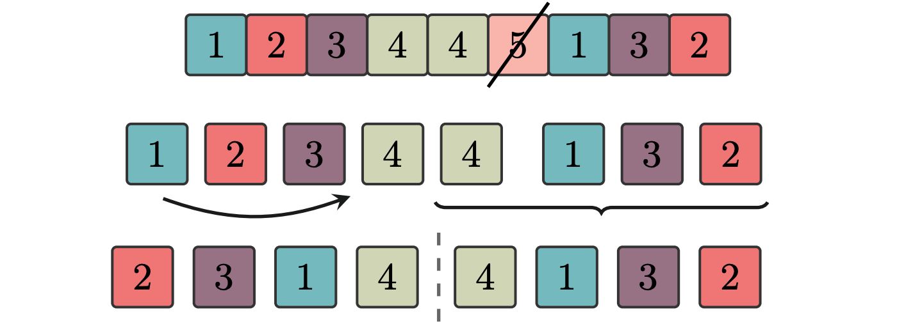
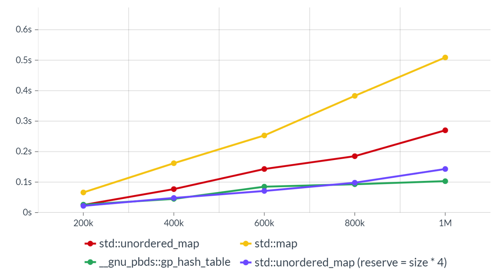
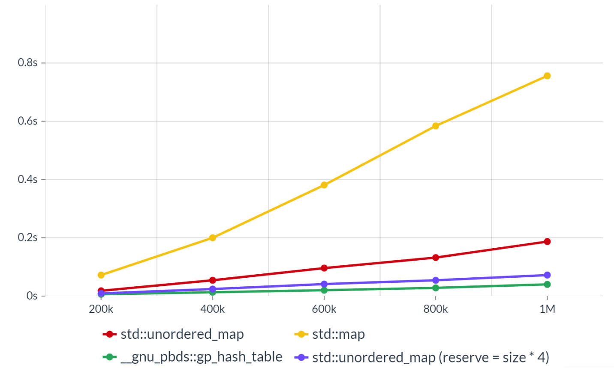
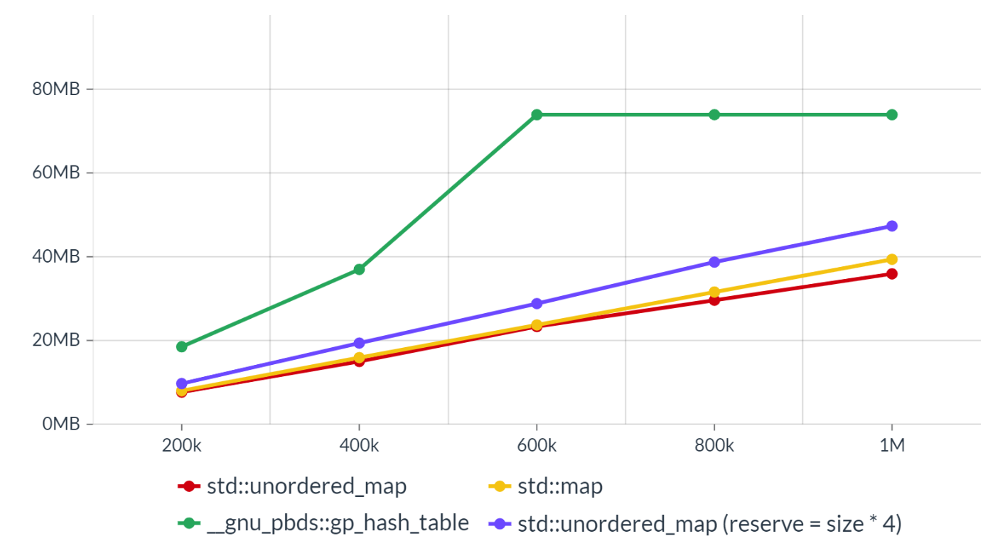

## Giới thiệu

Hash (băm), là việc biến đầu vào có kích thước bất kì thành giá trị đầu ra có kích thước cố định.

Hash có tính ứng dụng rất lớn ở nhiều lĩnh vực trong thực tế. Trong lập trình thi đấu, ngoài ứng dụng việc kiểm tra tính bằng nhau các đối tượng có tính thứ tự như xâu, Hash cũng có thể dùng để kiểm tra tính bằng nhau của các tập hợp (không có tính thứ tự).

Trong rất nhiều bài toán, Hash có tốc độ thực thi nhanh hơn, cài đặt dễ hơn so với các thuật toán tất định.

Bài viết sẽ trình bày một số cách Hash tập hợp phổ biến cùng một số vấn đề liên quan.

## Một chút về sinh số ngẫu nhiên
Các phương pháp trình bày ở dưới đều liên quan đến sinh số ngẫu nhiên, chất lượng số ngẫu nhiên có thể ảnh hưởng đến tính chính xác của thuật toán.

Một trong những phương pháp sinh số ngẫu nhiên phổ biến trên máy tính là sử dụng các công thức toán học để tạo ra một dãy số (pseudorandom number generator) từ với một seed cho trước (thường được lấy là thời gian của hệ thống). Seed giống nhau sẽ tạo ra các dãy giống nhau.
Ví dụ ta có hàm $f(x) = x \times 3 \mod 11$, nếu chọn seed là 1, số đầu tiên của dãy là $f(1) = 3$, số thứ hai là $f(f(1)) = 9$, số thứ ba là $f(f(f(1))) = 5$...

Nếu không cẩn thận, các số được sinh ra sẽ mất tính ngẫu nhiên, nên đây là một vấn đề rất đáng lưu tâm.

Không chỉ trong phạm vi bài toán sử dụng phương pháp Hash, phần này áp dụng cho tất cả các bài toán có liên quan đến sinh số ngẫu nhiên.

### Hàm `rand()`:
Khi mới làm quen với việc sinh số ngẫu nhiên trong C++, có lẽ hầu hết chúng ta đều sử dụng hàm `rand()`. Tuy nhiên hàm này chỉ có thể sinh ra số ngẫu nhiên trong đoạn $[0, {RAND\_MAX}]$ với `RAND_MAX` là một hằng số, tùy thuộc vào trình biên dịch, được đảm bảo có giá trị ít nhất $32767$. Đây là một giá trị quá nhỏ, khả năng cao sẽ gây ra các kết quả sai. Chưa kể hàm `rand()` được cài đặt bằng một [thuật toán tương đối đơn giản](https://en.wikipedia.org/wiki/Linear_congruential_generator).

Có thể sinh một số mới từ các giá trị sinh ra từ hàm `rand()`. Tuy nhiên cần lưu ý tính ngẫu nhiên của số mới tạo ra có thể không được cao. Ví dụ, nhân 2 giá trị sinh ra từ hàm `rand()` sẽ tạo ra số mới có 75% khả khả năng là số chẵn.

### MT19937
Sử dụng thuật toán [Mersenne Twister](https://en.wikipedia.org/wiki/Mersenne_Twister), phát triển dựa trên số nguyên tố Mersenne $2^{19937}-1$, cũng là chu kì của nó. Cài đặt của thuật toán trong C++ được biết với tên `mt19937`, có thể tạo ra số ngẫu nhiên tốt hơn hàm `rand()`.

Lưu ý là `mt19937` chỉ có thể sinh số nguyên 32-bit, nếu muốn sinh số nguyên 64-bit thì cần dùng `mt19937_64`.

Cách sử dụng:
```c++
#include <bits/stdc++.h>
using namespace std;

int main(){
	long long seed = time(0);
	mt19937 rng32(seed);
	cout << "random 32: " << rng32() << endl;
	mt19937_64 rng64(seed);
	cout << "random 64: " << rng64() << endl;
}
```

Ở đây `time(0)` chính là seed, là số giây tính từ 01/01/1970. Nên nếu chạy code trong cùng một giây thì sẽ được kết quả giống nhau. Trong các kì thi như HSGQG thì seed này là đủ tốt. 

Để tránh bị hack khi tham gia contest trên các nền tảng như Codeforces (bị các thí sinh khác biết được seed, tính trước được các giá trị sinh ra và sinh test chặn), có thể sử dụng seed là `chrono::steady_clock::now().time_since_epoch().count()`, cũng là thời gian nhưng có độ chính xác cao hơn, ít nhất đến mili giây, rất khó để có thể xác định được seed.

## Các phương pháp Hash

### Hash với phép XOR

#### Bài toán
Một dãy số $b_1, b_2, ..., b_k$ được gọi là hoàn hảo nếu nó là một hoán vị của $1, 2,...,k$.

Cho một dãy số nguyên $a$ độ dài $n \le 10^5$ với $1\le a_i \le n$ và $q \le 10^5$ truy vấn có dạng $(l, r)$, hãy cho biết dãy con $a_l, a_{l + 1},...,a_r$ có phải là dãy số hoàn hảo hay không?

#### Nhận xét
Ta cần so sánh $a_l, a_{l + 1},...,a_{r}$ và $1, 2,...,r - l + 1$, tính thứ tự không quan trọng.

#### Giải pháp
Ta sẽ gán một số nguyên khác không ngẫu nhiên $h(i)$ cho mỗi giá trị $i$ từ $1$ đến $n$.

Phép XOR có tính chất giao hoán, dễ thấy dãy con $a_l, a_{l + 1},...,a_r$ hoàn hảo thì biểu thức sau phải thỏa mãn, tuy nhiên phải lưu ý rằng chiều ngược lại có thể không đúng: $$\begin{array}{l}
h(1) \oplus h(2) \, \oplus \, ... \, \oplus \, h(r - l + 1) \\
\qquad = h(a_l) \oplus h(a_{l + 1}) \, \oplus \, ... \, \oplus \, h(a_r)
\end{array}$$

Đây là bài toán cơ bản có thể dễ dàng xử lí bằng mảng tiền tố.

Có thể có phần tử lặp lại trong dãy $a$, nên nếu một phần tử xuất hiện chẵn lần sẽ giống với việc không xuất hiện lần nào. Tuy vậy nếu có phần tử xuất hiện nhiều lần thì mã Hash của dãy con sẽ khác với mã Hash của $h(1) \oplus h(2) \, \oplus \, ... \, \oplus \, h(r - l + 1)$.

#### Khả năng xung đột
Mỗi bit trong phép XOR là độc lập. Xét riêng một bit, nếu 2 bit đầu vào được đảm bảo là ngẫu nhiên thì bit đầu ra sẽ có 50% là bit 0 và 50% là bit 1, khả năng xung đột sẽ là $1 \over 2$. Vậy với $k$ bit, khả năng xung đột sẽ là $1 \over 2^k$ mỗi truy vấn.

Có thể dễ dàng sinh các số ngẫu nhiên 64-bit, khả năng xung đột mỗi truy vấn chỉ là $1 \over 2^{64}$, đủ tốt cho các bài toán trong lập trình thi đấu.

### Hash với phép cộng

#### Bài toán
Cho hai dãy số nguyên $a$ độ dài $n$ và $b$ độ dài $m$ ($n, m \le 10^5$) với $1\le a_i \le n$ và $q \le 10^5$ truy vấn có dạng:$$
l \; r \; k
\\
u_1 \; v_1
\\
u_2 \; v_2
\\
...
\\
u_k \; v_k$$

tổng $k$ trong tất cả các truy vấn không quá $10^5$.

Hãy cho biết dãy con $a_l, a_{l + 1},...,a_r$ có gồm đúng $v_1$ số $u_1$, $v_2$ số $u_2$,...,$u_k$ số $v_k$ hay không?

#### Nhận xét
Giống với bài toán ở phần trước, ta cũng cần kiểm tra tính bằng nhau của hai tập hợp, thứ tự của các phần tử không quan trọng. Nhưng không thể dùng phép XOR vì phép XOR sẽ không bảo toàn được tần suất xuất hiện của các phần tử.

#### Giải pháp
Ta sẽ gán một số nguyên khác không ngẫu nhiên $h(i)$ cho mỗi giá trị $i$ từ $1$ đến $n$.

Thay vì dùng phép XOR, ta dùng phép cộng, dãy con $a_l, a_{l + 1},...,a_r$ hoàn hảo khi, cũng giống phương pháp XOR, chiều ngược lại cũng có thể không đúng:$$\begin{array}{l}
h(a_l) + h(a_{l + 1}) +...+ h(a_r) \\
\qquad = h(u_1) \times v_1 + h(u_2) \times v_2 + ... + h(u_k) \times v_k
\end{array}$$

#### Khả năng xung đột
Trong cài đặt thực tế, ta thường sử dụng một module $M$ để tránh tràn số, hoặc thậm chí để tràn số luôn cũng không sao (khi đó $M = 2^{64}$ nếu ta để dữ liệu kiểu số nguyên 64-bit không dấu).

Nếu dụng module $P$ là số nguyên tố lớn. Xét 2 multiset $A$ và $B$ khác nhau mà $h(A) \equiv h(B)$ và $C = A \cap B$ nên $h(A - C) \equiv h(B - C)$.

Giả sử $x$ là số chỉ xuất hiện trong $A - C$ và $y$ là số lần xuất hiện của $x$. Do $0 < y < P$ nên có thể sử dụng nghịch đảo modulo, ta có $h(x)\equiv {1 \over y}[h(B-C)-h(A-C-\{x\}×y)]$. Vì $h(x)$ thuộc khoảng $[1, P)$ nên khả năng xung đột là $1 \over {P - 1}$.

Tuy vậy kể cả khi module $M$ không nguyên tố, khả năng xung đột cũng vẫn là khoảng $1 \over M$. Với $M$ đủ lớn, hoặc khi thực hiện các phép tính tràn số ($M = 2^{64}$), khả năng này là đủ nhỏ.

## Ứng dụng trong một số bài toán
### [Bài toán 1 - Facebook hackerup 2022 Round 2 - A2 - Perfectly Balanced](https://www.facebook.com/codingcompetitions/hacker-cup/2022/round-2/problems/A2)
*Trước khi đến với phần lời giải, bạn đọc có thể thử sức với bài toán.*
#### Tóm tắt đề bài

Một dãy số $b_1, b_2, ..., b_k$ gọi là hoàn hảo nếu $k$ là số nguyên dương chẵn và có thể sắp xếp lại $b_1, b_2...,b_{k \over 2}$ sao cho $b$ trở thành dãy đối xứng.

Cho một dãy $A$ có độ dài $N$ gồm các phần tử $1 \le A_i \le 10^6$ và $Q$ truy vấn có một trong hai dạng sau:
- $1 \; X_i \; Y_i$: Gán số nguyên $1 \le Y_i \le 10^6$ cho $A_{X_i}$.
- $2 \; L_i \; R_i$: kiểm tra xem dãy con $A_{L_i...R_i}$ có tạo ra dãy "gần hoàn hảo" không?

Định nghĩa của dãy "gần hoàn hảo" là có thể xóa đi đúng 1 số của dãy đó để tạo ra được dãy hoàn hảo như ví dụ dưới.



#### Lời giải
Sử dụng phương pháp Hash với phép cộng. Ta có tập $H = \{h(1), h(2),...,h(10^6)\}$, $f(l, r) = h(a_l) + h(a_{l + 1}) + ... + h(a_r)$.

Dĩ nhiên ta chỉ xét dãy con có độ dài lẻ. Khi ấy với $m = \lfloor{{(l+r)} \over { 2}}\rfloor$ nếu $f(l, m) - f(m + 1, r) \in H$ hoặc $f(m, r) - f(l, m - 1) \in H$ thì dãy con "gần hoàn hảo", vì hiệu của hai phần chính là mã Hash của phần tử cần bị xóa.

Truy vấn $1$ được xử lí bằng các Cấu trúc dữ liệu (CTDL), ví dụ [Segment Tree](https://vnoi.info/wiki/algo/data-structures/segment-tree-basic.md).

```c++
#include <bits/stdc++.h>
using namespace std;

typedef unsigned long long ull;

const int maxn = 1e6 + 5;

int n;
ull rnd[maxn];
mt19937_64 rng(time(0));
unordered_set<ull> H;

// Segment Tree thực hiện thao tác cập nhật điểm và truy vấn đoạn
struct SegmentTree{
    vector<ull> node;
    SegmentTree (int n): node(4 * n + 12){}

    void update(int v, int l, int r, int pos, ull val){
        if(r < pos || l > pos) return;
        if(l == r){
            node[v] = val;
            return;
        }

        int m = (l + r) >> 1;
        update(v << 1, l, m, pos, val);
        update(v << 1 | 1, m + 1, r, pos, val);
        node[v] = node[v << 1] + node[v << 1 | 1];
    }

    ull get(int v, int l, int r, int tl, int tr){
        if(r < tl || l > tr) return 0;
        if(tl <= l && r <= tr) return node[v];

        int m = (l + r) >> 1;
        return get(v << 1, l, m, tl, tr) + get(v << 1 | 1, m + 1, r, tl, tr);
    }
};

void init(){
    // Khởi tạo các giá trị ngẫu nhiên
    for(int i = 0; i < maxn; i++){
        rnd[i] = rng();
        H.insert(rnd[i]);
    }
}

void solve(int test){
    int q, ans = 0;

    cout << "Case #" << test << ": " ;
    cin >> n;
    SegmentTree segmentTree(n);

    for(int i = 1; i <= n; i++){
        int p; cin >> p;
        segmentTree.update(1, 1, n, i, rnd[p]);
    }

    cin >> q;
    while(q--){
        int type, l, r;
        cin >> type >> l >> r;

        if(type == 1){
            segmentTree.update(1, 1, n, l, rnd[r]);
        }else{
            if(l == r){
                ++ans;
                continue;
            }
            if((r - l) % 2 == 1) continue;

            // Kiểm tra liệu f(l, m) - f(m + 1, r) có thuộc tập H?
            int m = (l + r) / 2;
            ull L = segmentTree.get(1, 1, n, l, m),
                R = segmentTree.get(1, 1, n, m + 1, r);
            
            if(H.count(L - R)){
                ++ans;
                continue;
            }

            // Kiểm tra liệu f(m, r) - f(l, m - 1) có thuộc tập H?
            L = segmentTree.get(1, 1, n, l, m - 1),
            R = segmentTree.get(1, 1, n, m, r);

            if(H.count(R - L)){
                ++ans;
                continue;
            }
        }
    }

    cout << ans << '\n';
}

signed main(){
    ios_base::sync_with_stdio(false); cin.tie(0); cout.tie(0);
        
    init();

    int t;
    cin >> t;
    for(int i = 1; i <= t; i++)
        solve(i);
}
```

### [Bài toán 2 -- HNOJ -- trafficsystem](https://hnoj.edu.vn/problem/trafficsystem)
*Trước khi đến với phần lời giải, bạn đọc có thể thử sức với bài toán.*
#### Tóm tắt đề bài

Một đất nước có $n \le 10^5$ thành phố. Để di chuyển giữa 2 thành phố có 2 cách là sử dụng hệ thống đường bộ hoặc tàu điện ngầm (2 chiều). Ban đầu đất nước chưa có đường nối nào.

Cho $q \le 10^5$ truy vấn thuộc hai loại sau:
*  $1 \; u \; v$: Thiết lập đường bộ giữa 2 thành phố $u$ và $v$.
*  $2 \; u \; v$: Thiết lập đường tàu điện ngầm giữa 2 thành phố $u$ và $v$.

Sau mỗi truy vấn hãy cho biết hệ thống giao thông của đất nước có tốt không? In ra `YES` hoặc `NO` tương ứng với có hoặc không.

Hệ thống giao thông được gọi là tốt khi với mọi cặp thành phố $i < j$, nếu $i$ đi được đến $j$ qua đường bộ thì cũng phải đi được qua hệ thống tàu điện ngầm và ngược lại.

#### Nhận xét
Ta coi hệ thống đường bộ và tàu điện ngầm là 2 đồ thị riêng biệt. Coi mỗi thành phần liên thông là một tập hợp chứa các thành phố. Bài toán trở thành so sánh tập hợp $A$ và $B$, trong đó $A$ là tập hợp của các thành phần liên thông $C_i$ đường bộ, $B$ là tập hợp của các thành phần liên thông $D_i$ tàu điện ngầm.


Trong hình ta có tập $A = \{\{1, 2, 3\}, \{5, 6, 7, 8\}\}$, $B = \{\{1, 2, 3\}, \{5, 6, 7, 8\}\}$. Như vậy có thể kết luận hệ thống này là tốt.

#### Lời giải
Với mỗi đỉnh ta sẽ gán một số nguyên khác không ngẫu nhiên. Với mỗi thành phần liên thông ta cần lưu giá trị Hash của các đỉnh thuộc tập đó, là XOR của tất cả giá trị được gán cho mỗi đỉnh. Việc này có thể dễ dàng xử lí được bằng CTDL [Disjoint Set](https://vnoi.info/wiki/algo/data-structures/disjoint-set).

Ta thu được 2 tập hợp $A = \{h(C_1), h(C_2), \ldots, (C_p)\}$ và
$B = \{h(D_1)$, $h(D_2)$, $\ldots$, $h(D_q)\}$. Lực lượng của 2 tập vẫn có thể lên tới $O(n)$.

Một cách đơn giản là lấy tổng $S_A = h(C_1) + h(C_2) + \ldots + h(C_p)$ và $S_B = h(D_q) + h(D_q) + \ldots + h(D_q)$ rồi đem so sánh. Việc cập nhật $S_A$ và $S_B$ được thực hiện gộp 2 thành phần liên thông khi xử lí truy vấn.

```c++
#include <bits/stdc++.h>
using namespace std;

typedef unsigned long long ull
const int maxn = 100005

ull r[maxn];
mt19937_64 rng(time(0));

struct DisjointSet{
    vector<int> parent;
    vector<ull> value;
    ull s;

    DisjointSet(int n, ull r[]): parent(n + 1), value(n + 1), s(0){
        for(int i = 1; i <= n; i++){
            parent[i] = i;
            value[i] = r[i];
            s += r[i];
        }
    }

    int find(int u){
        if(u != parent[u]) return parent[u] = find(parent[u]);
        return u;
    }

    bool join(int u, int v){
        u = find(u);
        v = find(v);
        if(u == v) return false;
        parent[u] = v;

        // Xóa 2 giá trị cũ
        s -= value[v] + value[u];

        // Gộp giá trị Hash của 2 thành phần liên thông
        value[v] ^= value[u];

        // Thêm giá trị mới
        s += value[v];
        
        return true;
    }
};

signed main(){
    ios_base::sync_with_stdio(false); cin.tie(0); cout.tie(0);

    int n, q;
    cin >> n >> q;

    // Khởi tạo các giá trị ngẫu nhiên cho từng đỉnh    
    for(int i = 1; i <= n; i++){
        r[i] = rng();
    }

    vector<DisjointSet> disjointSet(2, DisjointSet(n, r));

    while(q--){
        int x, u, v;
        cin >> x >> u >> v;
        disjointSet[x - 1].join(u, v);
        
        if(disjointSet[0].s == disjointSet[1].s)
            cout << "YES\n";
        else
            cout << "NO\n";
    }
}
```

### Lời bình
Trong cả hai bài toán trên, đều tồn tại lời giải bằng thuật toán tất định, việc này nhường lại cho bạn đọc.

Có thể thấy lời giải bằng Hash so với lời giải dùng thuật toán tất định rất dễ nghĩ ra chỉ là cải tiến từ hướng nghĩ của cách làm "trâu", cũng dễ cài, tốc độ thực thi nhanh.

## Lưu trữ Hash
Trong rất nhiều trường hợp ta cần lưu trữ một lượng lớn các giá trị Hash để tiện cho việc kiểm tra, so sánh về sau. Việc lưu trữ một cách hiệu quả có thể giúp tránh việc mất điểm đáng tiếc hoặc cũng có thể tăng tốc các thuật toán chưa tối ưu (suboptimal).

Thông thường, ta sẽ sử dụng các CTDL có sẵn để tiết kiệm thời gian. Để giúp bạn đọc lựa chọn CTDL phù hợp nhất cho lời giải của mình, dưới đây sẽ so sánh tốc độ của các CTDL sau trong các trường hợp khác nhau:

* `std::map`: Độ phức tạp các thao tác là $\mathcal{O(log \,n)}$.
* `std::unordered_map`: Độ phức tạp trung bình $\mathcal{O(1)}$, trường hợp tệ nhất $\mathcal{O(n)}$.
* `__gnu_pbds::gp_hash_table`: Độ phức tạp trung bình $\mathcal{O(1)}$, trường hợp tệ nhất $\mathcal{O(n)}$. 

`__gnu_pbds::gp_hash_table` là một CTDL tương đối "lạ", để sử dụng được CTDL này:

```c++
#include <bits/stdc++.h>
#include <ext/pb_ds/assoc_container.hpp>
using namespace __gnu_pbds;
using namespace std;

int main(){
    gp_hash_table<int, int> m;
    m[3] = 1;
    cout << m[3];
}
```
Tuy vậy cách dùng cũng không có nhiều khác biệt với 2 CTDL phổ biến là `std::map` và `std::unordered_map`.

Các bài kiểm tra dưới đây đều được dịch bằng C++14 trên hệ thống của Codeforces.

### Tốc độ chèn
Chèn các phần tử là các số nguyên 64-bit ngẫu nhiên.



### Tốc độ đọc
Đọc các phần tử là các số nguyên 64-bit ngẫu nhiên.


### Bộ nhớ
Bộ nhớ (Megabyte) khi chèn các phần tử là các số nguyên 64-bit ngẫu nhiên.


### Nhận xét
- `std::map`:
Nhìn chung với tập dữ liệu ngẫu nhiên, `std::map` có thời gian thực thi lâu nhất. Ở đây ta lưu các giá trị Hash, tính thứ tự không quan trọng thì việc sử dụng `std::map` là lựa chọn không tối ưu.

- `__gnu_pbds::gp_hash_table`:
Tốn tương đối nhiều bộ nhớ nhưng có tốc độ nhanh nhất. Một số trình biên dịch, ví dụ Clang, không sử dụng được CTDL này.

- `std::unordered_map`:
Nếu ước lượng được số lượng key có thể thực hiện reserve bộ nhớ cho `std::unordered_map`, có thể giảm thời gian thực thi đáng kể, đổi lại là việc sử dụng nhiều bộ nhớ hơn một chút:
    ```c++
    std::unordered_map<int, int> um;
    um.reserve(SIZE * 4);
    ```
    Nếu không thể ước lượng được số lượng key, có thể giảm load factor (tỉ lệ giữa số lượng phần tử có trong hash map và số lượng bucket) xuống khoảng 0.25, tùy trường hợp sẽ giúp giảm thời gian thực thi (tuy vậy sẽ sử dụng nhiều bộ nhớ hơn đáng kể):
    ```c++
    um.max_load_factor(0.25);
    ```


Tốc độ của các CTDL này còn phụ thuộc vào hàm Hash, có thể tham khảo tại [đây](https://codeforces.com/blog/entry/62393). Tuy vậy trong hầu hết trường hợp không cần quan tâm vì hàm Hash mặc định vẫn chạy rất tốt trên tập dữ liệu ngẫu nhiên.

Bài kiểm tra trên mang tính chất tham khảo, do thời gian thực thi tùy thuộc vào bài toán và bộ test. Một cách để chọn CTDL phù hợp là sinh một số test lớn, chọn CTDL có thời gian chạy nhanh nhất.

## Lời bạt
Có thể thấy Hash là kĩ thuật "nhỏ mà có võ" trong lập trình thi đấu.

Ngoài ra trong nhiều bài toán mà thuật toán chính để giải không phải là Hash, liên quan đến việc kiểm soát rất nhiều dữ liệu, Hash như một công cụ đắc lực giúp việc cài đặt nhanh và dễ hơn.

Hi vọng cả những nội dung về sinh số ngẫu nhiên và quản lí dữ liệu được trình bày ở trên cũng sẽ giúp ích cho hành trình lập trình thi đấu của bạn đọc!

## Bài tập áp dụng
* [Bedao Grand Contest 10 - PERFECT](https://oj.vnoi.info/problem/bedao_g10_perfect) (Nếu $p$ là mảng các số nguyên không âm không quá $n$)
* [Atcoder ABC250E - Prefix Equality](https://atcoder.jp/contests/abc250/tasks/abc250_e)
* [Hackerrank - Number Game on a Tree](https://www.hackerrank.com/contests/hourrank-17/challenges/number-game-on-a-tree/editorial)
* [Codeforces 1175F - The Number of Subpermutations
](https://codeforces.com/problemset/problem/1175/F)
* [Codeforces 1418G - Three Occurrences](https://codeforces.com/contest/1418/problem/G)

## Đọc thêm
- [`uniform_int_distribution`, một cách sinh số ngẫu nhiên khác từ C++11 trở đi](https://en.cppreference.com/w/cpp/numeric/random/uniform_int_distribution)
- [Sơ bộ về bảng băm](https://vnoi.info/wiki/algo/data-structures/hash-table.md)
- [`__gnu_pbds::gp_hash_table`](https://usaco.guide/gold/faster-hashmap?lang=cpp)

## Tham khảo
- [Codeforces](https://codeforces.com/blog/entry/85900)
